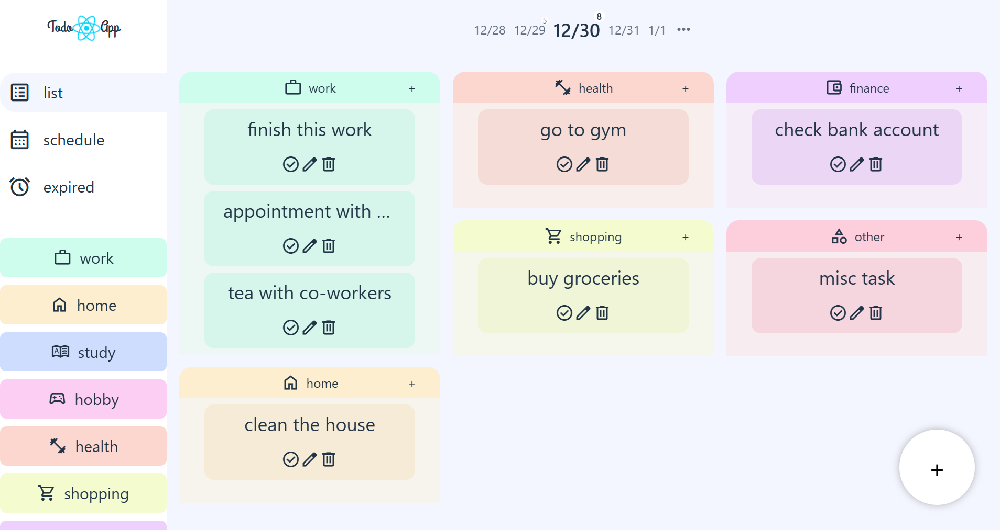
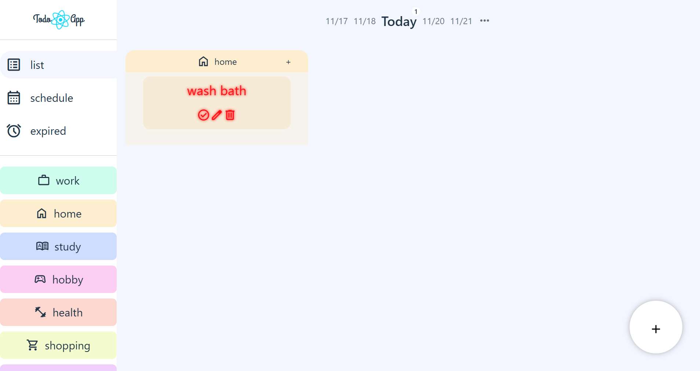

[日本語版はこちら](./READMEJP.md)

## 🌐 Live Demo
You can access the live demo of this application here: [https://pinattutaro.github.io/todo/](https://pinattutaro.github.io/todo/)

# React Todo App

This is a feature-rich single-page Todo application built with React, TypeScript, and Vite. It provides a comprehensive set of tools for personal task management with a focus on a smooth and intuitive user experience.

## ✨ Features

### Core Functionality
- **Todo Management**: Create, edit, and delete tasks. Each task includes a description, a deadline, and a completion status.
- **Project-Based Organization**: Organize tasks into customizable projects, each with a unique name, color, and icon for easy visual distinction.
- **Data Persistence**: All tasks and projects are automatically saved to the browser's `localStorage`, ensuring your data is safe between sessions.

### UI & UX
- **Date-Centric Dashboard**: The main view displays tasks for a selected day, grouped by project.
- **Interactive Date Navigation**:
    - A header component shows a 5-day view (today ± 2 days) for quick navigation.
    - A badge on each date indicates the number of due tasks.
    - A full date picker is available to jump to any specific date.
- **Dynamic Navigation Panel**:
    - Switch between different views (`List`, `Calendar`, `Expired`). *Currently, only the List view is implemented.*
    - Filter tasks by clicking on projects in the side panel to toggle their visibility.
    - Drag-and-drop projects to reorder them to your preference.
- **Rich Task Blocks**:
    - Tasks are color-coded based on their deadline: overdue, due today, or due in the future.
    - Mark tasks as complete with a single click. Completed tasks are struck through and can be cleared from the list by clicking them again.
    - An intuitive inline editor allows you to change a task's description, deadline, and parent project on the fly.
- **Drag-and-Drop Task Reordering**: Easily reorder tasks within a project list via drag-and-drop.
- **Flexible Task Creation**:
    - A global `+` button to quickly add a task to a default project.
    - A project-specific `+` button to add a task directly to the relevant project.

## 📸 Screenshots

### Main Screen

_The main interface showcasing the task list and project organization._

### Mobile View
<figure>
  
  <figcaption>Responsive design for seamless access on mobile devices.</figcaption>
</figure>

### Urgent Task Warning

_Visual alert for tasks due today, ensuring timely completion._

### 🚧 Planned Features
- **Calendar View**: A visual way to see your tasks on a monthly calendar.
- **Expired View**: A dedicated section to review all past-due tasks.

## 🛠️ Tech Stack
- **Framework**: React
- **Language**: TypeScript
- **Build Tool**: Vite
- **Animations**: Framer Motion for smooth drag-and-drop interactions.
- **Styling**: Plain CSS with dynamic inline styles.

## 🚀 Getting Started

### Prerequisites
- Node.js
- npm or yarn

### Installation & Running
1. Clone the repository.
2. Install dependencies:
   ```bash
   npm install
   ```
3. Run the development server:
   ```bash
   npm run dev
   ```
4. Open your browser and navigate to the provided local URL.

## 🗓️ Project Details
- **Development Period**: November 6, 2025 - November 19, 2025
- **Production Time**: 20 hours
